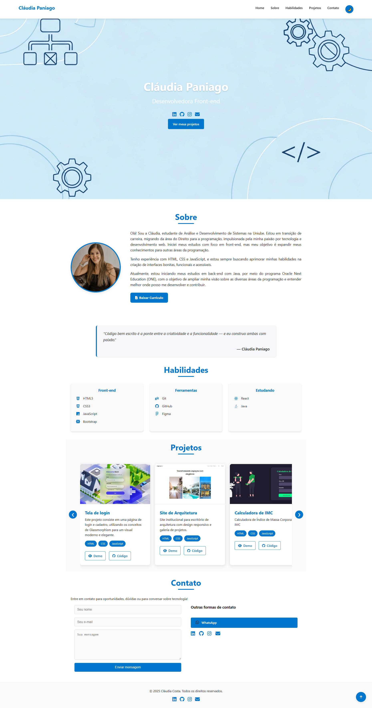

## Portfólio Pessoal – Claudia Paniago
Este repositório contém o código-fonte do meu portfólio pessoal, desenvolvido com HTML, CSS e JavaScript. O objetivo é apresentar minhas habilidades, projetos e trajetória como estudante de programação.

 

 ## Acesse o Projeto
Você pode visualizar o portfólio em funcionamento através do seguinte link:

 

 🔗 [portfolioclaudia.vercel.app](https://portfolioclaudia.vercel.app)

  

 ## Tecnologias Utilizadas
- HTML5: Estruturação semântica das páginas.
- CSS3: Estilização e layout responsivo.
- JavaScript: Interatividade e funcionalidades dinâmicas.

## Estrutura do Projeto
 - index.html: Página principal do portfólio.
- styles/: Diretório contendo os arquivos de estilo CSS.
- img/: Pasta com as imagens utilizadas no site.
- app.js: Script JavaScript para funcionalidades interativas.

## Funcionalidades
 - Design responsivo para diferentes tamanhos de tela.
- Seções dedicadas a informações pessoais, projetos e contato.
- Animações suaves para uma experiência de usuário agradável.

##  Layout Responsivo

O site foi projetado com foco na boa experiência de navegação em celulares, tablets e desktops.  
 **Observação:** o layout ainda está em fase de ajustes para responsividade total. Algumas seções precisam de adaptações para garantir melhor visualização em diferentes tamanhos de tela.  

## ❤️ Contato
claudiacostapaniago@gmail.com
